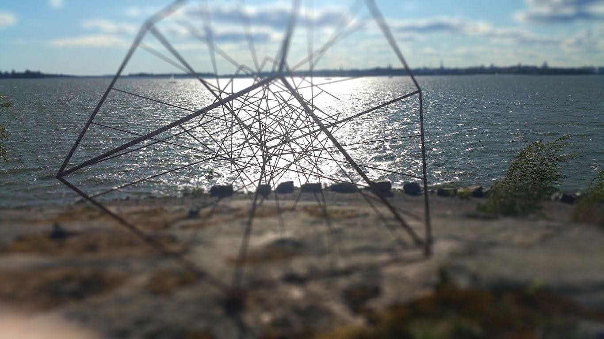
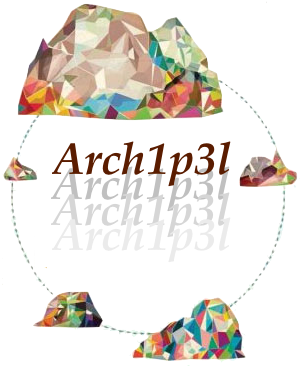
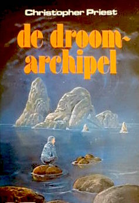
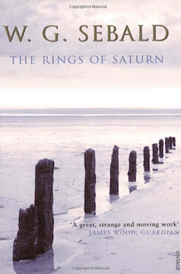

This project is a chimera, metonymically reflecting 4 senses of the meaning of the term:

1. a mythical animal, formed from parts of various animals
2. a thing which is hoped for, but is illusory or impossible to achieve: *'enlightenment is real, but the enlightened person is a chimera'*
3. an organism containing a mixture of genetically different tissues, formed by processes such as fusion of early embryos, grafting, or mutation
4. a DNA molecule with sequences derived from two or more different organisms

The 10 parts merged into this chimera are:

1. the Turku and Åland archipelago, together comprising ~ 46,500 islands, most of which are rocky islets
2. the East coast of the Gulf of Bothnia
3. the slipstream writing of:
	- Chris Priest
	- W.G. Sebald 
4. an agent-based model of transportation, using Solid
	- see the *parambulator* in Neal Stephenson's *Seven Eves*
5. cognitive science 
6. perennial philosophy
7. sociobiology
8. health, wellness, resilience
9. adaptation to climate change, pandemics, and syndemics
10. 'You'

Our goal is to enable you to visit the Archipelago, and have an experience in which these ten elements are seamlessly combined. 

